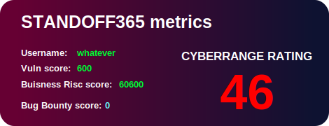

### Hi there 👋

<!--
**OohWhatever/OohWhatever** is a ✨ _special_ ✨ repository because its `README.md` (this file) appears on your GitHub profile.

Here are some ideas to get you started:

- 🔭 I’m currently working on ...
- 🌱 I’m currently learning ...
- 👯 I’m looking to collaborate on ...
- 🤔 I’m looking for help with ...
- 💬 Ask me about ...
- 📫 How to reach me: ...
- 😄 Pronouns: ...
- ⚡ Fun fact: ...
-->
# My Project

Here is the dynamic SVG image that updates every hour:

## Other Sections of Your README
- Description
- Installation
- Usage
- etc.

